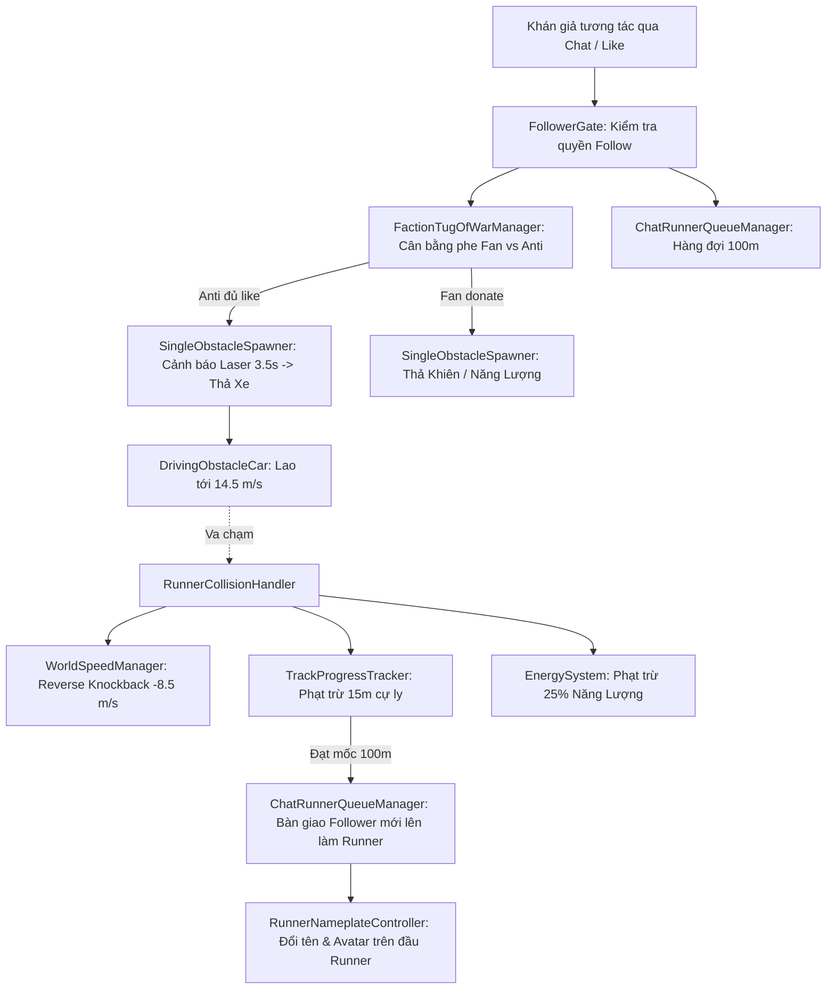

# 📖 HƯỚNG DẪN KIẾN TRÚC MÃ NGUỒN (SCRIPTS ARCHITECTURE GUIDE)

> **Dự án:** StreamRushLive (Team 2) — TikTok Live Interactive 3-Lane Endless Runner  
> **Phiên bản chuẩn hóa:** **v0.3** (`Prototype chatland.unity`)  
> **Nguyên tắc thiết kế cốt lõi:**  
> 1. **Mô hình Treadmill Runner:** Runner đứng cố định tại trục chạy (X = 9.55m), thế giới (mặt đường, dãy phố, vật cản) cuộn ngược chiều tạo cảm giác di chuyển.  
> 2. **Không có cơ chế Máu / Game Over (No HP / Endless Relay):** Runner không bao giờ chết vì va chạm; va chạm chỉ gián đoạn vật lý (đẩy lùi Runner, xung cuộn ngược thế giới, trừ cự ly, trừ năng lượng). Buổi livestream là một luồng chạy tiếp sức vô tận liên tục.  
> 3. **Xa lộ 3 làn xe:** Làn Trái (Z = +3.0m), Làn Giữa (Z = 0.0m), Làn Phải (Z = -3.0m).  
> 4. **Kiến trúc Modul Decoupled:** Giao tiếp qua `EventBus`, không tham chiếu chéo phụ thuộc chặt chẽ giữa các module.

---

## 🗺️ SƠ ĐỒ PHÂN BỔ THƯ MỤC CHÍNH

```
Assets/_Project/Scripts/
├── Core/                     # Hệ thống nền tảng dùng chung (EventBus, Năng lượng, Vận tốc thế giới)
├── Features/
│   ├── Runner/               # Điều khiển nhân vật, vật lý thảm chạy, va chạm, console chat
│   ├── Spawning/             # Sinh vật cản xe tự lái, vật phẩm hỗ trợ Fan, Base Classes
│   ├── StreamIntegration/   # Tích hợp livestream (Phe Fan vs Anti, Lọc quyền Follower)
│   ├── Track/               # Theo dõi cự ly, trôi 16 Tiles phố, vật thể thế giới
│   └── UI/                  # Quản trị HUD, Thanh tiến trình, Bảng tên 3D, Popup, Toast
└── Legacy_v0.2/             # [LƯU TRỮ NỘI BỘ] Các script cũ thuộc cơ chế v0.2 đã bãi bỏ
```

---

## 1. THƯ MỤC `Core/` — HỆ THỐNG NỀN TẢNG DÙNG CHUNG

| Tên Script | Vai trò & Trách nhiệm chính |
| :--- | :--- |
| **`EventBus.cs`** | **Hệ thống Publish / Subscribe tĩnh Decoupled.** Cho phép các module giao tiếp mà không cần tham chiếu trực tiếp nhau. Ví dụ: Khi phe Anti đủ like, `FactionTugOfWarManager` phát `RequestCarSpawnEvent`, `ChatRunnerCarSpawnAdapter` lắng nghe và yêu cầu Spawner thả xe. |
| **`EnergySystem.cs`** | **Hệ thống quản lý Năng lượng của Runner.** Năng lượng tự động tiêu hao theo thời gian (`energyDrainPerSecond = 10/s`). Khi năng lượng > 0, Runner được tăng tốc bứt phá (Sprint). Phát sự kiện `OnEnergyNormalizedChanged` cập nhật thanh năng lượng trên HUD. |
| **`WorldSpeedManager.cs`** | **Bộ điều phối vận tốc của toàn bộ thế giới cuộn.** Điều chỉnh tốc độ cơ bản (8.0 m/s), bứt tốc Sprint (18.0 m/s), hãm trượt Slide, và hồi phục gia tốc mượt mà. Đặc biệt sở hữu hàm `TriggerReverseWorldKnockback(peakSpeed: -8.5m/s)` tạo xung lực cuộn ngược toàn bộ phố xá khi có va chạm mạnh. |

---

## 2. THƯ MỤC `Features/Runner/` — ĐIỀU KHIỂN & VẬT LÝ NHÂN VẬT

| Tên Script | Vai trò & Trách nhiệm chính |
| :--- | :--- |
| **`ChatLaneRunnerController.cs`** | **Bộ điều khiển chuyển 3 làn đường qua lệnh Chat.** Quản lý vị trí Z của Runner theo 3 làn (+3m, 0m, -3m). Nhận lệnh chat (`left`, `right`, `jump`, `slide`, `fast`, `slow`), phối hợp tiêu hao năng lượng và thực hiện hiệu ứng giật lùi Runner (`ApplyKnockback`) khi có va chạm xe. |
| **`RunnerController.cs`** | **"Bộ não" vật lý của Runner trên thảm chạy Treadmill.** Khóa cứng trục X = 9.55m, chỉ cho phép nhảy/rơi tự do trên trục Y. Tự áp trọng lực thủ công (lên 9.6 m/s², rơi 18.0 m/s²) để đỉnh nhảy đạt đúng 2.2m theo chuẩn GDD. Tự động tính toán **Forgiving Hitbox** (co nhỏ Collider 15% so với Mesh thật lúc Awake) để tránh va chạm oan. |
| **`RunnerCollisionHandler.cs`** | **Trung tâm tiếp nhận & giải quyết va chạm.** Khi chạm vật cản: nếu có Khiên (`Shield`) -> hủy vật cản, bảo toàn cự ly. Nếu không có Khiên -> kích hoạt đồng thời: trừ cự ly tiến trình (-15m), trừ năng lượng (-25%), kích hoạt cuộn ngược thế giới (`Reverse World Knockback`), và bật 2.0s nhấp nháy bất tử (`i-Frames`). |
| **`RunnerInputHandler.cs`** | **Bộ đọc phím bàn phím cục bộ (Dành cho Developer kiểm thử).** Hỗ trợ các phím cứng: Phím Space/W/Mũi tên lên để Nhảy; S/Ctrl/Mũi tên xuống để Cúi/Trượt; Shift/E để Sprint. Tự động vô hiệu hóa phím bấm khi con trỏ chuột đang nằm trong ô nhập text (`TMP_InputField`). |
| **`MockChatConsole.cs`** | **Bảng điều khiển giả lập Livestream trong Game.** Cung cấp khung chat UI cho phép gõ trực tiếp lệnh của khán giả, kết hợp các phím tắt nhanh: `F1` (Tặng khiên), `F2` (Tặng bình năng lượng), `F3` (Thả xe cản đường Anti). Giúp test toàn bộ tương tác người xem mà không cần máy chủ TikTok thật. |
| **`RunnerItemEffects.cs`** | **Quản lý trạng thái hiệu ứng Buff trên Runner.** Theo dõi thời gian duy trì của Khiên bảo vệ (`Shield`), hiệu ứng Nhảy cao (`High Jump`), và tiêu thụ khiên khi có va chạm. |
| **`ChatRunnerQueueManager.cs`** | **Quản lý Hàng đợi Người xem tiếp sức (Relay Queue).** Tiếp nhận người xem bấm Follow vào danh sách chờ. Khi Runner chạy đủ chặng **100 mét**, hệ thống chọn người tiếp theo trong hàng đợi lên làm Runner chính, cập nhật tên và avatar mới mà không làm ngắt quãng trận đấu. |

---

## 3. THƯ MỤC `Features/Spawning/` — SINH VẬT CẢN & VẬT PHẨM

### 3.1. Các Lớp Cơ Sở Đa Hình (Base Classes & Enums) — Tuyệt đối không xóa!
* **`ObstacleBase.cs` [ABSTRACT CLASS]:** Lớp cha trừu tượng của toàn bộ chướng ngại vật trong game. Quy định sẵn phần trăm trừ năng lượng (`EnergyPenaltyPercent`), cự ly bị trừ (`DistancePenaltyMeters`), thời gian đóng băng khung hình (`HitStopDuration`) và cờ chống va chạm trùng lặp (`HasCollided`).
* **`ItemBase.cs` [ABSTRACT CLASS]:** Lớp cha trừu tượng của các vật phẩm có thể nhặt. Định nghĩa hàm thu thập `Collect(GameObject runner)`.
* **`SpawnableObject.cs` [BASE CLASS]:** Lớp nền tảng cho mọi đối tượng được Spawner sinh ra trên đường ray.
* **`ObstacleType.cs`, `ItemType.cs`, `SpawnType.cs` [ENUMS]:** Các bảng định nghĩa danh mục chủng loại vật cản và vật phẩm.

### 3.2. Các Script Vật Cản & Vật Phẩm Thực Thi
| Tên Script | Vai trò & Trách nhiệm chính |
| :--- | :--- |
| **`SingleObstacleSpawner.cs`** | **Spawner thông minh 3 làn xe.** Sinh xe cản đường cho phe Anti và vật phẩm cho phe Fan trên các làn Z = +3, 0, -3. Có dải **Laser đỏ nhấp nháy cảnh báo trước 3.5 giây**. Giới hạn tối đa 2 vật cản cùng lúc để luôn đảm bảo có ít nhất 1 làn trống cho Runner né. |
| **`DrivingObstacleCar.cs`** | **Xe ô tô đô thị tự lái ngược chiều.** Sở hữu vận tốc chạy tự thân (6.5 m/s) cộng dồn với tốc độ thế giới thành 14.5 m/s lao về phía Runner. Tự động xoay 4 bánh xe theo mặt đường và rung lắc nổ máy nhẹ. Sau va chạm, xe bị thế giới kéo giật lùi rồi tự hủy. |
| **`ShieldItem.cs`** | **Vật phẩm Khiên bảo hộ.** Do khán giả phe Fan donate thả xuống mặt đường. Khi Runner nhặt được, nhận lớp khiên bảo vệ chặn 1 lần va chạm xe ô tô. |
| **`BuffItem.cs`** | **Vật phẩm Bình Năng Lượng.** Do khán giả phe Fan thả xuống; hồi phục ngay **+20% Năng Lượng** cho Runner. |

---

## 4. THƯ MỤC `Features/StreamIntegration/` — TÍCH HỢP LIVESTREAM & PHE PHÁI

| Tên Script | Vai trò & Trách nhiệm chính |
| :--- | :--- |
| **`FactionTugOfWarManager.cs`** | **Quản lý Đại chiến Kéo co (Fan vs Anti).** Phân chia khán giả theo cú pháp chat `#fan` (hoặc `#blue`) và `#anti` (hoặc `#red`). Đếm số lượng like và quà tặng. Khi phe Anti tích lũy đủ 500 tim, tự động kích hoạt sự kiện thả 1 xe ô tô cản đường Runner. |
| **`FollowerGate.cs`** | **Cổng kiểm soát quyền hạn Follower.** Đảm bảo chỉ những tài khoản đã bấm Follow kênh livestream mới có quyền can thiệp vào game (gửi lệnh chuyển làn, bứt tốc, hoặc xếp hàng chờ chạy tiếp sức). |
| **`ChatRunnerCarSpawnAdapter.cs`** | **Bộ chuyển đổi sự kiện thả xe.** Lắng nghe `RequestCarSpawnEvent` từ `EventBus` khi phe Anti đủ điểm, rồi gọi trực tiếp `SingleObstacleSpawner.TriggerSpawnCarFromAntiLikes()` để sinh xe trên đường. |
| **`ChatCommandSanitizer.cs`** | **Bộ chuẩn hóa chuỗi lệnh chat.** Tự động chuyển ký tự về chữ thường, cắt bỏ khoảng trắng thừa và dấu câu để bộ phân tích lệnh (`MockChatConsole` hoặc Stream Parser) nhận diện chính xác. |

---

## 5. THƯ MỤC `Features/Track/` — MÔI TRƯỜNG & THẾ GIỚI CUỘN

| Tên Script | Vai trò & Trách nhiệm chính |
| :--- | :--- |
| **`TrackProgressTracker.cs`** | **Bộ đếm quãng đường và tiến trình chặng.** Đo đạc chính xác cự ly chạy thực tế, trừ cự ly khi va chạm (-15m), cập nhật tỷ lệ phần trăm chặng 100m lên thanh tiến trình HUD, và kích hoạt sự kiện hoàn thành chặng để chuyển giao gậy. |
| **`TrackTileLooper.cs`** | **Hệ thống trôi tuần hoàn 16 Tiles đại lộ PolygonCity.** Đồng bộ di chuyển 16 mảnh đường ray mang trọn vẹn kiến trúc phố xá, tòa nhà, vỉa hè và cây xanh; tự động dịch chuyển tile đã đi qua về phía trước chân trời, tạo cảm giác đại lộ dài vô tận với 0% giật cục (No Pop-in). |
| **`MovingWorldObject.cs`** | **Script di chuyển theo tốc độ thế giới.** Gắn trên các vật thể sinh ra trên đường (vật cản, item, xe cộ), đảm bảo vật thể trôi đồng tốc độ với mặt đường và tự hủy khi trôi ra sau lưng Runner. |

---

## 6. THƯ MỤC `Features/UI/` — GIAO DIỆN NGƯỜI DÙNG (HUD & VIEWS)

| Tên Script | Vai trò & Trách nhiệm chính |
| :--- | :--- |
| **`HUDManager.cs`** | **Mẫu thiết kế Facade điều phối HUD.** Cung cấp các hàm public tập trung (`UpdateProgress`, `UpdateEnergy`, `UpdateRunnerInfo`, `ShowStatusPopup`) để các module khác cập nhật thông tin hiển thị mà không cần can thiệp sâu vào từng View UI con. |
| **`FactionTugOfWarUI.cs`** | **Thanh hiển thị tỷ số Kéo co Fan vs Anti.** Cập nhật đồ họa thanh cân bằng lực lượng hai phe, hiển thị số lượt Like và số người tham gia của mỗi bên theo thời gian thực. |
| **`ChatRunnerUIBinder.cs`** | **Cầu nối dữ liệu giữa Logic Stream và Giao diện UI.** Lắng nghe các thay đổi từ `FactionTugOfWarManager` và `ChatRunnerQueueManager` để cập nhật trực tiếp lên màn hình. |
| **`ChatRunnerStatusUI.cs`** | **Bảng trạng thái phụ trợ của Runner.** Hiển thị vận tốc thế giới hiện tại, làn chạy hiện tại và chế độ đang kích hoạt (`Normal`, `Sprint`, `Slide`). |
| **`Views/ProgressBarController.cs`** | Quản lý thanh tiến trình chạy chặng 100m (0 -> 100%). |
| **`Views/RunnerNameplateController.cs`** | **Bảng tên 3D Billboard trên đầu Runner.** Tự động xoay mặt về phía `Camera.main`, hiển thị tên và avatar của khán giả đang điều khiển chặng đua. |
| **`Views/EnergyBarController.cs`** | Quản lý thanh hiển thị năng lượng tiêu hao/bứt tốc của Runner. |
| **`Views/StatusPopupSpawner.cs` & `StatusPopupController.cs`** | Sinh và quản lý hoạt ảnh chữ nhảy lơ lửng khi nhận hiệu ứng (ví dụ: *"Khiên Bảo Vệ"*, *"Năng lượng +20%"*, *"Va chạm xe (-15m)"*). |
| **`Views/GiftToastController.cs` & `GiftToastQueue.cs`** | Quản lý hàng đợi thông báo Toast vinh danh người xem khi gửi quà tặng hoặc donate. |

---

## 7. QUY TRÌNH LUỒNG DỮ LIỆU CHÍNH (GAMEPLAY PIPELINE)



---
*Tài liệu này được biên soạn chuẩn hóa cho kiến trúc mã nguồn v0.3. Khi thêm script mới vào dự án, hãy đặt vào đúng thư mục chuyên trách tương ứng và cập nhật bảng giải thích tại đây.*
